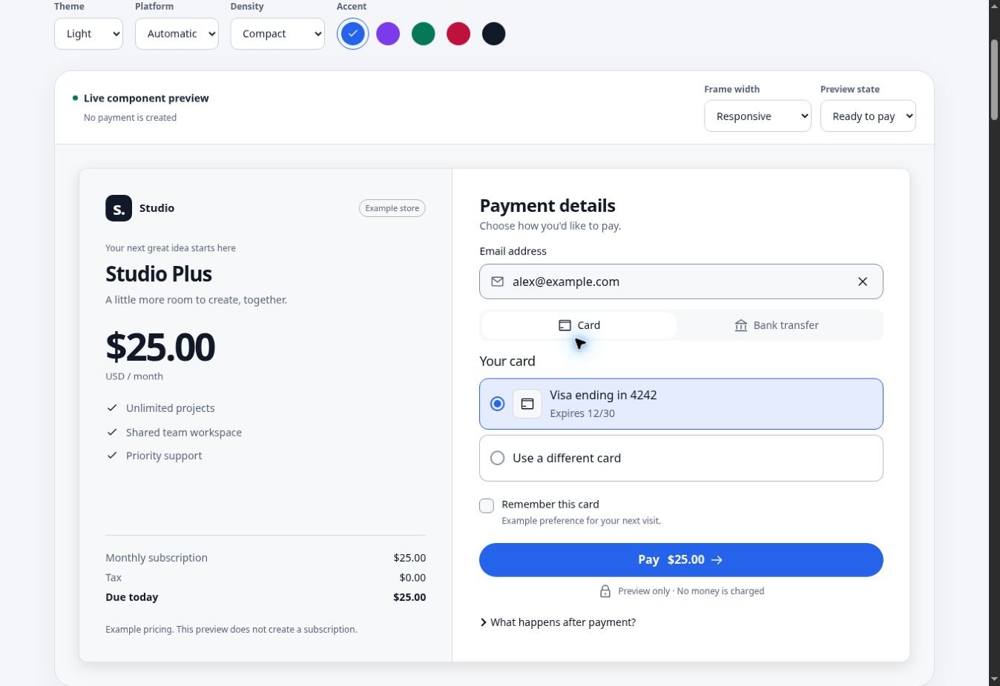

# Checkout kit

A headless payment engine with provider adapters, a browser runtime and optional React UI.
Use one checkout flow for Stripe, Adyen, PayPal or a provider of your own.

The application supplies the order, collects a payment instrument using the provider's SDK,
and renders any requested action. The merchant API owns prices, credentials and payment truth.
The core handles attempts, retries, cancellation, polling and redirect recovery.

Browse the [English documentation](https://pavel-labs.github.io/checkout-kit/) or [русскую документацию](https://pavel-labs.github.io/checkout-kit/ru/). Start with the [package catalog](https://pavel-labs.github.io/checkout-kit/packages.html), then follow provider, React, recovery and merchant-server guides.

## Try a complete checkout

Requires Node.js 24 and npm.

```bash
npm ci
npm run dev:integration
```

Open <http://localhost:5173>, select **Stripe adapter**, **Adyen adapter** or **PayPal adapter**.
The local merchant server runs at port 4000. No account or API key is needed.

For Stripe and Adyen, use `pm_mock_approve`, `pm_mock_decline`, `pm_mock_challenge` or
`pm_mock_processing` in the payment token field. PayPal opens an approval page. Redirects
leave the app and return to it, restoring the pending checkout from session storage.

This command uses an explicit **protocol simulator**. For official sandbox SDK calls,
Stripe Elements, Adyen encrypted fields and webhooks, follow [the server guide](./examples/server/README.md).

## Packages

| Package                                              | Purpose                                                                  |
| ---------------------------------------------------- | ------------------------------------------------------------------------ |
| `@checkout-kit/core`                                 | Headless engine, payment types, plugin and runner contracts, HTTP client |
| `@checkout-kit/runtime-browser`                      | Redirects, iframes, SDK handoffs, storage and return URL parsing         |
| `@checkout-kit/react`                                | Provider, hooks and action host for React 19                             |
| `@checkout-kit/ui`                                   | Optional accessible checkout components and scoped styles                |
| `@checkout-kit/provider-stripe`                      | PaymentIntents, PaymentMethod tokens and Stripe.js actions               |
| `@checkout-kit/provider-adyen`                       | Advanced flow, encrypted component data, 3DS2 and redirects              |
| `@checkout-kit/provider-paypal`                      | Orders, approval and verified capture status                             |
| `@checkout-kit/webview-bridge`                       | Native host and web-side checkout messaging                              |
| `@checkout-kit/testing`, `@checkout-kit/conformance` | Mock API and the executable contract for custom plugins                  |

Six additional `provider-*` packages demonstrate generic PSP, acquiring, hosted-page,
hosted-fields, wallet and bank-transfer protocols against the mock API. They are references
for building your own integration; they do not connect to banks by themselves.

## Why use it

Keep one lifecycle across providers: preserve attempts after a lost reply, reconcile processing
payments, run 3DS/redirect/SDK actions and recover after navigation. Use your own interface or
compose the optional UI. Add `observeCheckout` for categorical metrics without sending payment
payloads to analytics. For a single hosted payment page, the provider's own SDK may be sufficient.

The [production guide](./docs/production.md) explains what the kit guarantees and what your
merchant server must implement. Browser actions enforce transport/origin rules; dynamic SDK
scripts need explicit permission. Adyen raw card data is disabled unless expressly enabled.
These new defaults and telemetry are in source for the next release, not the older `0.2.0` bundle.

## Install in another project

Download and extract `checkout-kit-0.2.0.tar.gz` from [GitHub Releases](https://github.com/pavel-labs/checkout-kit/releases/tag/v0.2.0). From your application's directory, select the packages you need:

```bash
node /path/to/checkout-kit-0.2.0/install.mjs runtime-browser provider-stripe react ui
```

The installer verifies SHA-512 integrity and includes required checkout-kit peers automatically.
Use `provider-adyen` or `provider-paypal` for those adapters. Omit `react ui` for a host without
React. npm resolves external peers normally. `--list` lists packages and `--dry-run` verifies
without installing. Individual `.tgz` assets can also be installed together with their peers.

To build the current source instead, run `npm run pack:packages` in a clone and use
`artifacts/packages/install.mjs`. CI uploads the same files as `checkout-kit-packages`.
`npm run verify:consumer` tests all 16 archives, minimal headless/React installations, strict
TypeScript, exports, checkout and SSR, and rejection of damaged downloads.

Bundle `0.2.0` includes `@checkout-kit/ui@0.2.0` and the other 15 packages at `0.1.0`.
Package versions are independent; the installer uses the manifest to select compatible archives.
This is an early release. GitHub archives need no private registry access. The
separate registry workflow still requires access to the `@checkout-kit` scope and credentials;
archive publication does not imply npm publication. See [Releasing](./RELEASING.md).

Public npm release preparation now targets `registry.npmjs.org` with public access and a manual
OIDC/provenance workflow. Scope ownership, first publication and actual sandbox-account checks
remain separate release steps. Until npm availability is verified, use the archives above or
build the current source. The [release guide](./RELEASING.md#public-npm-publication) includes dry-run,
initial scope setup and the exact trusted publisher settings.

## Integrate

Register the adapter with your merchant API, then give the engine browser runners:

```ts
import { createCheckout, defineProvider } from '@checkout-kit/core'
import { createBrowserRuntime } from '@checkout-kit/runtime-browser'
import { createStripeSdkAdapter, type StripeConfig } from '@checkout-kit/provider-stripe'
import { loadStripe } from '@stripe/stripe-js/pure'

const stripe = loadStripe(yourPublishableKey)
const runtime = createBrowserRuntime({
  returnPath: '/payment/return',
  sdk: {
    adapters: [
      createStripeSdkAdapter(async () => {
        const client = await stripe
        if (!client) throw new Error('Stripe.js could not load.')
        return client
      }),
    ],
  },
})
const engine = createCheckout({
  providers: [
    defineProvider({
      id: 'stripe',
      config: { baseUrl: '/api/stripe', credentials: 'include' } satisfies StripeConfig,
      load: () => import('@checkout-kit/provider-stripe'),
    }),
  ],
  defaultProviderId: 'stripe',
  runners: runtime.runners,
  storage: runtime.storage,
  returnUrl: runtime.returnUrl,
})

// `paymentMethod` comes from Stripe Elements, not a raw card input.
const result = await engine.pay({
  input: { planId: '1id' },
  instrument: { kind: 'token', token: paymentMethod.id },
  idempotencyKey: orderAttemptId,
})
if (result.status === 'requires_action') await engine.runPendingAction()
// On /payment/return:
await engine.hydrate(runtime.readReturnParams())
```

For React, wrap the screen in `CheckoutProvider`, read `useCheckout()` and render
`PaymentActionHost` for pending actions. The [plain React example](./examples/react/App.tsx)
shows collection, submission, processing, failure, receipts and return recovery.

Keep an idempotency key for the same attempt, including a lost response. A declined attempt
can use a new key. When an intent is still processing, check its status before starting another
payment. `reset()` clears the local attempt; it does not cancel a charge at the provider.

The three adapters use different merchant endpoints. Their package READMEs define exact DTOs,
SDK callbacks and server responsibilities:
[Stripe](./packages/provider-stripe/README.md), [Adyen](./packages/provider-adyen/README.md),
[PayPal](./packages/provider-paypal/README.md).

## Design and verification

The engine follows **create → confirm → action/evidence → resume → outcome**. Actions describe
what the provider needs; runners decide how the host can execute it. A new provider or host
extends a contract rather than adding provider-specific branches to the core.

The core has no React or DOM dependency. Provider SDKs belong to the host application and
merchant server. Return URLs and SDK callbacks are evidence to reconcile with server state;
they are never proof of payment. Fulfillment, refunds and settlement belong to the merchant.

CI checks package and example types, unit and conformance tests, payment and UI browser suites, builds,
package exports and installation outside the monorepo. Tests use fixtures and local simulators.
Live sandbox verification with your own Stripe, Adyen or PayPal account is a separate step.
The example server stores orders and replay results in memory: use durable storage and
application authentication when adapting it for a deployed merchant.

```bash
npm test
npm run test:e2e
npm run test:integration
npm run test:ui
npm run verify:consumer
```

Explore the [live UI gallery](https://pavel-labs.github.io/checkout-kit/demo/gallery): a composed checkout, light/dark themes, brand variants, mobile frames and component specimens.



## Guides

English and Russian guides, plus a generated API reference:

- Getting started: [English](./docs/getting-started.md) / [Русский](./docs/ru/getting-started.md)
- Architecture: [English](./docs/architecture.md) / [Русский](./docs/ru/architecture.md)
- Writing a provider: [English](./docs/plugin-authoring.md) / [Русский](./docs/ru/plugin-authoring.md)
- Browser and SDK integration: [English](./docs/integrations.md) / [Русский](./docs/ru/integrations.md)
- UI: [English](./docs/ui.md) / [Русский](./docs/ru/ui.md)
- Payment security: [English](./docs/production.md) / [Русский](./docs/ru/production.md)
- Safe telemetry: [English](./docs/observability.md) / [Русский](./docs/ru/observability.md)
- Merchant backend: [English](./docs/backend.md) / [Русский](./docs/ru/backend.md)
- Native apps: [English](./docs/webview.md) / [Русский](./docs/ru/webview.md)

[Documentation site](https://pavel-labs.github.io/checkout-kit/) ·
[Examples](./examples/README.md) · [Release process](./RELEASING.md)

Apache-2.0. See [LICENSE](./LICENSE) and [NOTICE](./NOTICE).
